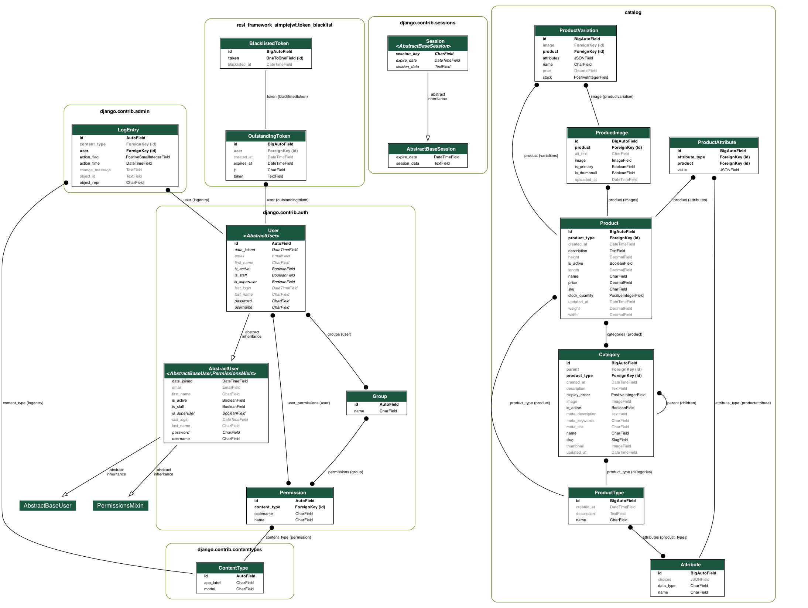

# Ecommerce Catalog API

### Running the Docker container

To run the Django project and the DB

```bash
docker-compose build
docker-compose up
```
### Running the Tests

To run the tests, use the following command:

```bash
python manage.py test
```

## Project Overview

- **Technologies Used**:
    - Django
    - Django Rest Framework (DRF)
    - PostgreSQL
    - Docker

## Features

- **Core Features**:
    - Catalog
- **Additional Features**:
    - JWT Authentication using HTTP Cookies
    - Pagination

- **Search Filter**:
    - **URL**: `/api/products/`
    - **Description**: Enables filtering products and product variations by name, description, and attributes and variations attributes
    - . Supports searching by name, description, and attributes of products.


## Database Schema

- **ER Diagram**: 

## API Endpoints

- **Overview**: Provide an overview of the API endpoints.

- **Obtain Token Pair (Login)**
    - **URL**: `/api/login/`
    - **Method**: POST
    - **Description**: Obtain a JWT token pair (access and refresh tokens) for a user.

- **Refresh Token**
    - **URL**: `/api/refresh/`
    - **Method**: POST
    - **Description**: Refresh the access token using a valid refresh token.

- **User Registration**
    - **URL**: `/api/register/`
    - **Method**: POST
    - **Description**: Register a new user.

- **User Profile**
    - **URL**: `/api/profile`
    - **Method**: GET, PUT, PATCH
    - **Description**: Retrieve or update the user's profile information.
    -

#### Products

- **List and Create Products**
    - **URL**: `/api/products/`
    - **Methods**: GET, POST
    - **Description**: Retrieve a list of products or create a new product.

- **Retrieve, Update, and Delete Product**
    - **URL**: `/api/products/{id}/`
    - **Methods**: GET, PUT, PATCH, DELETE
    - **Description**: Retrieve, update, or delete a specific product by ID.

#### Categories

- **List Categories**
    - **URL**: `/api/categories/`
    - **Method**: GET
    - **Description**: Retrieve a list of categories.

#### Product Types

- **List Product Types**
    - **URL**: `/api/product-types/`
    - **Method**: GET
    - **Description**: Retrieve a list of product types.

#### Attributes

- **List Attributes**
    - **URL**: `/api/attributes/`
    - **Method**: GET
    - **Description**: Retrieve a list of attributes.


# ProductViewSet Tests

This section outlines the tests for the `ProductViewSet`, which cover CRUD operations for managing products.

## Test Class: `ProductViewSetTests`

### Tests

1. **List Products**
    - **URL**: `/products/`
    - **Method**: `GET`
    - **Expected Status Code**: `200 OK`

2. **Retrieve Product**
    - **URL**: `/products/<id>/`
    - **Method**: `GET`
    - **Expected Status Code**: `200 OK`

3. **Create Product**
    - **URL**: `/products/`
    - **Method**: `POST`
    - **Expected Status Code**: `201 Created`

4. **Update Product**
    - **URL**: `/products/<id>/`
    - **Method**: `PUT`
    - **Expected Status Code**: `200 OK`

5. **Partial Update Product**
    - **URL**: `/products/<id>/`
    - **Method**: `PATCH`
    - **Expected Status Code**: `200 OK`

6. **Delete Product**
    - **URL**: `/products/<id>/`
    - **Method**: `DELETE`
    - **Expected Status Code**: `204 No Content`

    